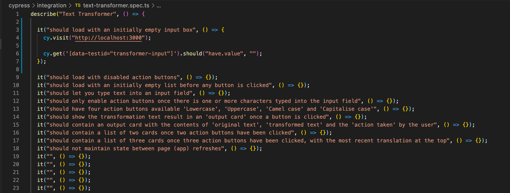
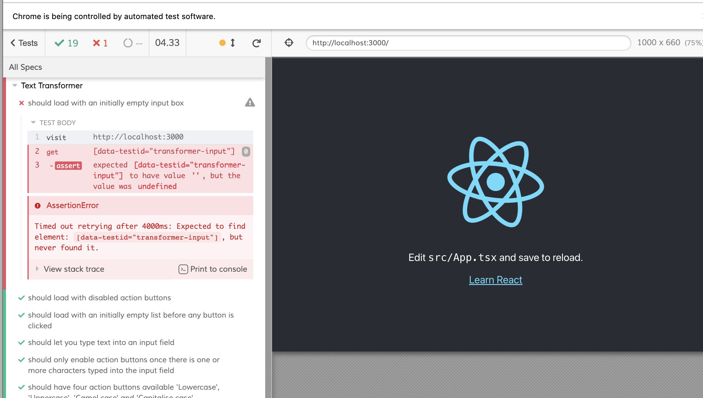

# tdd-tutorial

Tutorial for approaching TDD in the front-end

## High-Level Project Requirements: A Contrived Example

### PO Requirements

A Product Owner has come to us with a set of requirements for a basic text transformation app they need for one of their clients. These are the requirements our PO initially asks for:

- Build a simple UI with an input field, action buttons and an area for 'output cards'.
- An 'output card' should contain the original text from the input field, the transformed output text and the action that was performed on the original text.
- The actions that should be possible are:
  - Convert to 'lowercase'
  - Convert to 'UPPERCASE'
  - Convert to 'camelCaseTextWithoutSpaces'
  - Convert to 'Capitalise Case Text With Spaces'
- The UI design and UX is down to the discretion of the developer – there are no requirements for these.

### Requirements Analysis

Okay, now we have our requirements. Let's think about them from a developers' point-of-view. By this, I do not mean low-level code implementation, but more what should the finished product look like from a UI perspective. The requirements outlined above scream some initial obvious points:

- There should be a single input field. We can get this element by its accessible role i.e. 'textbox'. We will expect only one of these to be returned by the test query as the requirements state only an 'input field' should exist.
- There will be several buttons to perform actions on the input text. We can get all of these buttons using a role query then find the one we want to click on in the test by inspecting its 'label'.
- Assert there is an unordered list (ul) present on the page. You'd expect this 'ul' to be the output area containing the 'output cards'. The requirements do not state whether the 'output cards' should be unordered or ordered. Let's assume unordered for now but let's go back to the PO for some clarity on the requirements on this.
- An 'output card' should then be represented by a List Item (li). Once you've queried the markup in your test to return all list items, you'll then be able to assert the contents of each 'output card'.

One of my little tricks is to write tests asserting for accessible roles like 'textbox', 'button', 'list', 'link' and 'checkbox'. This will force us to write an implementation later on that is accessible. Two birds, one stone and all that!

Accessible role testing is best placed on the actual component view. React-testing-library is focused on this, so we'll leave this kind of testing until then. Our first focus to start with should be app testing as a whole and to do this, we'll use Cypress. Puppeteer is another possibility here, but I've chosen Cypress for this example simply because their API is very good. It's just a personal preference thing.

To write the feature-file test in Cypress, we can assert for the same things we listed above (textboxes, buttons and a list) but instead of using CSS selectors, classes or element IDs, it's recommended we use 'data-' attributes on the elements. This separates the tests from the implementation, making the tests less brittle and isolating them from CSS and JS changes.

## Integration Tests

### Writing a Feature File

Right, let's write a feature file to interact with the UI, asserting for the elements and interactions we are expecting to see as outlined above.

An approach I like to take is to write all the 'shoulds' first. This really makes you think about the final solution and forces you to think about how interactions will tie together. So, our simple text translation app (I typed this out exactly as I thought about it, in this order):

- Should let you type text into an input field.
- Should have four action buttons available: 'Lowercase', 'Uppercase', 'Camel case' and 'Capitalise case'.
  - _Thoughts: here, we were forced to think about the text we want displayed in the buttons._
- Should show the transformation text result in an 'output card' once a button is clicked.
  - _Thoughts: okay, so this is once a button is clicked but what should the state be before a button is clicked? Let's write a 'should' to cover this._
- Should load with an initially empty list before any button is clicked.
  - _Thoughts: so, the initial state of the list is empty but what about the initial state of the input box and buttons? Let's add a 'should'._
- Should load with an initially empty input box.
- Should load with disabled action buttons.
- Should only enable action buttons once there is one or more characters typed into the input field.
  - _Thoughts: okay, so that's everything around user interactions. Now let's refer back to the requirements and see what we've missed. Output card contents is missing!_
- Should contain an output card with the contents of 'original text', 'transformed text' and the 'action taken' by the user.
  - _Thoughts: we now need to think about the card history._
- Should contain a list of two cards once two action buttons have been clicked.
- Should contain a list of three cards once three action buttons have been clicked.
  - _Thoughts: okay, this is where we need to go back to our PO as ask for clarity, do we want the card history to be unordered or ordered?_

### Requirements Clarification

...we speak to the PO and they comes back to us with a list of clarifications:

- The 'output cards' should always remain visible once they appear, providing a history of all of the text transformations the user has performed.
- The transformation history should be presented as a list with the most recent at the top.
- The transformation history does not need to persist between page (app) refreshes.

...okay, this is brilliant. Our PO has clarified that we need the 'output card' history to exist as a list (we made an assumption previously here as the original requirements were a little ambiguous and only said 'an area for output cards'.) We also have some additional clarification that the list should be ordered and also the direction of ordering. The final clarification they provided is that the app does not need to save any state to a backend or local storage. It is fine for the app state to disappear when the app is unmounted.

### Conclude Feature File

Okay, let's carry on defining all of our 'shoulds':

- ~~Should contain a list of three cards once three action buttons have been clicked.~~
- Should contain a list of three cards once three action buttons have been clicked, with the most recent translation at the top.
  - _Thoughts: we should now assert for an 'ol', rather than a 'ul' as the list is ordered but this check will be done at the unit test level._
- Should not maintain state between page (app) refreshes.

That's about it for all of our UI integration test definitions. Let's now create a new project and add Cypress as a dep. Here's my [first boilerplate commit](https://github.com/robbutcher2001/tdd-tutorial/commit/30a4d75968d579f833d7ac16a31bd0b953505dbd).

We can now add these to a Cypress feature file (still without their implementation):


Commit: [3d3e0db](https://github.com/robbutcher2001/tdd-tutorial/commit/3d3e0db72115210aa2746ee41797b7c22635eb82).

Notice how I've rearranged the 'should' test descriptions in the feature file, starting with the most simple then increasing with complexity. This is a personal preference but I find it easier to start with simple tests and that you can use to build on to make more complex ones later on.

### Writing our Integration Tests

Now that we've written all of our integration test descriptions, it's time to fill out the implementations. As mentioned above, it's recommended to use 'data-' attributes on elements to keep tests separate from the implementation. It's also a good idea to run the test suite making sure every test runs and fails due to an assertion not being met rather than an error in the test code we've just written.

Right, let's look at the first test: 'should load with an initially empty input box'. Here, we are going to need to load the app, find an input box element and assert it has no text. We can use the Cypress API to help us:

- Load the app: `cy.visit('http://localhost:3000')`
- Get the input box and check it's empty: `cy.get('[data-testid="transformer-input"]').should('have.value', '')`

..and that's it! Our first test is written. Always make sure you writes tests that are small and simple otherwise you'll likely end up writing tests with bugs in because they're too large and complex!

We fill out our implementation and check that the test fails only because of assertions:





We continue in the same fashion for the other integration tests, which can be seen in this commit: [8467de1](https://github.com/robbutcher2001/tdd-tutorial/commit/8467de16b1db2d77b4a18d8600950df3b386b844). We use the Cypress docs and API to build up our test suite impls. In each test, we typically load a fresh UI, interact with some things then assert UI elements are in the state we expect. The layout of the tests and the CSS selectors used should be self-descriptive, explaining what each test is doing and what we're asserting. In the later, more complex tests, we assert the first `<li />` in a list has the content we expect using CSS selectors and also that we have the `<h1 />` and `<h2 />` headings in the places we expect them to be for the Output Cards.

By writing these tests first, we are forced to think of the html tags we intend to use for layout in the app. This helps us think about structure and ultimately, will make the implementation easier because we've already thought about the details of the app from end-to-end and how things will join up. Later, when writing unit tests for individual components, this same process will force us to think about the contract between components in a similar way, ahead of writing any implementation.

## Component Unit Tests

### First Component

Whilst we were writing our integration tests, we were made to think about the final solution as a whole. This gave us a rough idea of how we might implement it. Now we have that in mind, it's time to think about how we break that down into components.

Analysis of the requirements and writing of the integration tests has helped us realise we probably need the following components in order for our app to meet the feature requirements:

- a single input field
- a button (one of these for each of the 4 x actions)
- an output card list container
- an output card list item (multiple of these to populate the output card list container)

Let's choose the most simple, probably the button, and dive straight in with writing a test. We know from the requirements that the button needs to offer a disabled state as well as an enabled one. Let's start by writing a test for this. Remember, this is where we also start accessible role testing!

```
describe("Button component", () => {
  it("should be able to be disabled", () => {
    const { getByRole } = render(<Button disabled />);

    expect(getByRole("button")).toBeDisabled();
  });
});
```

We can also now test for the inverse if we do not provide the `disabled` prop:

```
it("should be enabled by default", () => {
  const { getByRole } = render(<Button />);

  expect(getByRole("button")).toBeEnabled();
});
```

What else does this button need to do? We will need to provide a callback function to the component in the app so we can handle button interaction. Let's write a test for that:

```
it("should call the callback", () => {
  const mockCallback = jest.fn();

  const { getByRole } = render(<Button callback={mockCallback} />);

  getByRole("button").click();

  expect(mockCallback).toHaveBeenCalledTimes(1);
});
```

Note, we have added a `callback` prop to the contract between the container and the component. Let's go back and retrospectively add this to the other tests we've already written. The callback does not need to be a function we intend to use, just there to fulfil the contract in the tests:

```
it("should be enabled by default", () => {
  const { getByRole } = render(<Button callback={() => {}} />);

  expect(getByRole("button")).toBeEnabled();
});

it("should be able to be disabled", () => {
  const { getByRole } = render(<Button disabled callback={() => {}} />);

  expect(getByRole("button")).toBeDisabled();
});
```

That's it in terms of tests that fulfil the requirements from the Product Owner but have we missed anything? Well, the button needs to render some text to display for the user right? That's something we've missed in our tests so let's add a test for that:

```
it("should display passed prop text", () => {
  const { getByText, getByLabelText } = render(
    <Button label='lowercase_action' callback={() => {}}>
     Lowercase
    </Button>
  );

  expect(getByText("Lowercase")).toBeInTheDocument();
  expect(getByLabelText("lowercase_action")).toBeInTheDocument();
});
```

Note, here we are not only asserting we find an element with the visible text, we are also using `getByLabelText` to make sure the button has been implemented with accessibility in mind. The button should be surrounded by a `<label />` tag if within a form or have an `aria-label` attribute if not. Remember to go back through the tests you've already written and add in the mandatory `label` prop you've just added to the contract.

That concludes the tests for the button. All of the requirements and responsibilities of the button are now covered by tests. The tests for the button can be found in this commit: [aedfc7c](https://github.com/robbutcher2001/tdd-tutorial/commit/aedfc7c8aec0991cee918a5f28d5ed3b22f2bc12).

### Other Components

Okay, let's now do the same for the remaining 3 components.

#### Input Component

Points to note:

- in typical React fashion, this will need to be a controlled component where any change of value in the input field, will need to set state in its container in order for the container to use the value of the input.
- this also means the value of the input should always be set externally. In this scenario, this is by the container. The input should therefore allow its value to be set by a prop.
